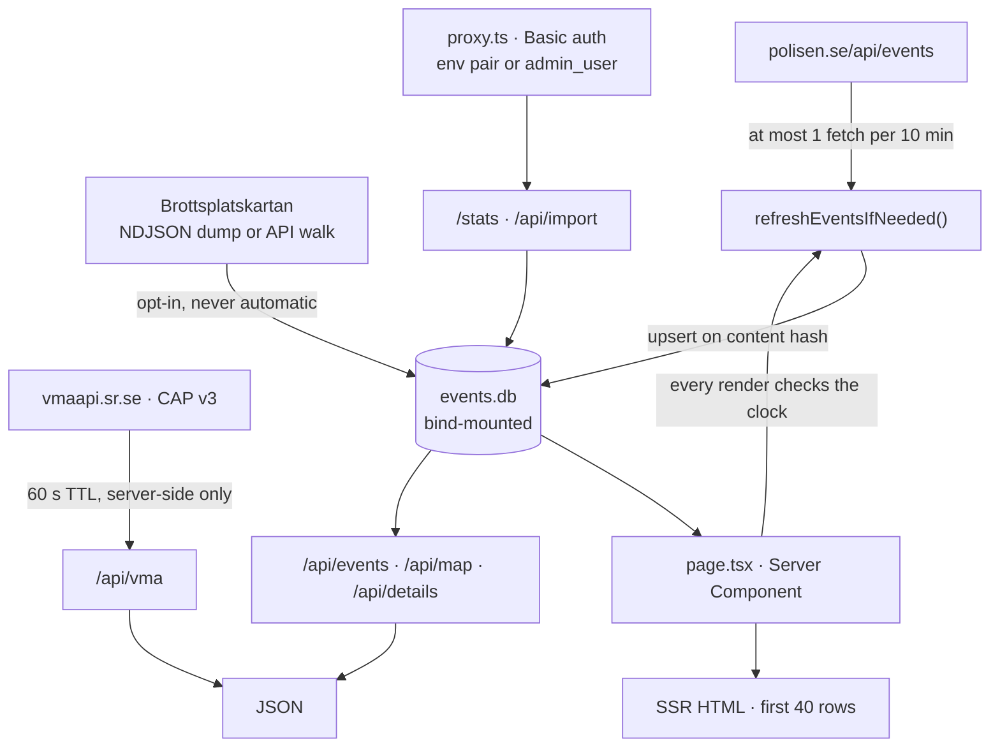
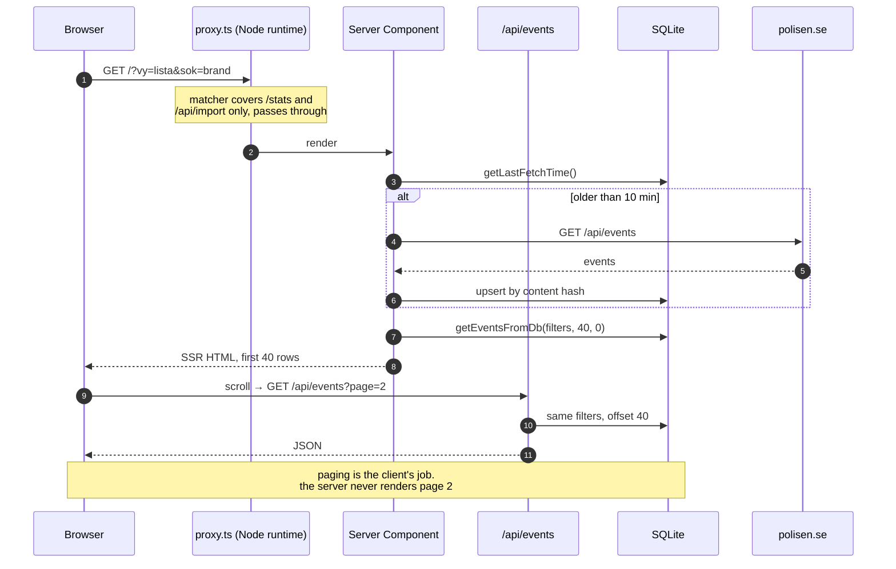
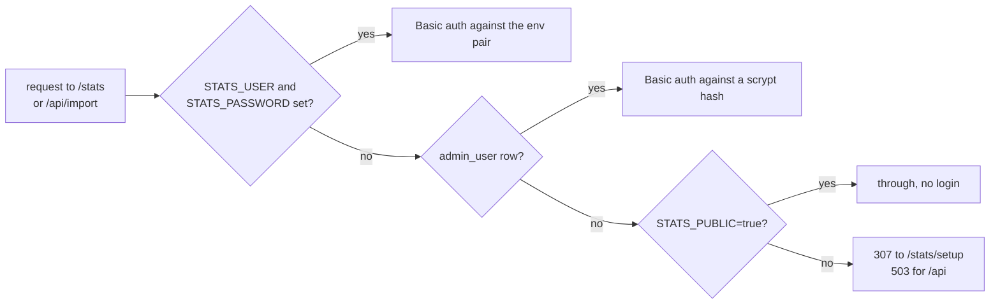
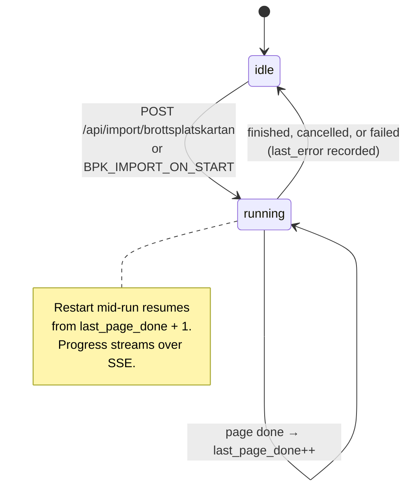

<pre> ███████╗ █████╗ ███╗   ███╗██████╗  █████╗ ███╗   ██╗██████╗
 ██╔════╝██╔══██╗████╗ ████║██╔══██╗██╔══██╗████╗  ██║██╔══██╗
 ███████╗███████║██╔████╔██║██████╔╝███████║██╔██╗ ██║██║  ██║
 ╚════██║██╔══██║██║╚██╔╝██║██╔══██╗██╔══██║██║╚██╗██║██║  ██║
 ███████║██║  ██║██║ ╚═╝ ██║██████╔╝██║  ██║██║ ╚████║██████╔╝
 ╚══════╝╚═╝  ╚═╝╚═╝     ╚═╝╚═════╝ ╚═╝  ╚═╝╚═╝  ╚═══╝╚═════╝
</pre>

A real-time view of Swedish police event notices. Fetches polisen.se every 10
minutes into SQLite and serves a list, a map and statistics from it. Ships as a
single container with a bind-mounted data directory.

## Where things stand

| Piece | State |
|-------|-------|
| **polisen.se feed** | The live source. Refreshes every 10 minutes, backfills ~a week on a fresh database, renders the list/map/statistics views |
| **Deployment** | One path: pull the image from GHCR and run `docker compose up -d`. Building from source is an override file, for development |
| **Brottsplatskartan archive** | Opt-in importer for ~333k historic events (2016→). Loads an NDJSON dump in under a minute, or walks the API over a few hours. Live progress on `/stats` |
| **Archive in the UI** | Part of the dataset. Feed, map, search, filters and statistics read the imported events alongside the live feed; the live feed wins for the period it covers, the archive supplies everything before it |

## How it works

One Node process, one SQLite file, no queue and no scheduler. Everything below
is driven by a request arriving.



**Ingest is lazy.** There is no cron. `page.tsx` sets `revalidate = 600`, and
each render calls `refreshEventsIfNeeded()`, which fetches only if the last
successful fetch is older than 10 minutes. A database with fewer than 200 rows
triggers a backfill over previous days instead of a single page. A counter caps
the process at 1440 upstream calls per 24 hours, so a pathological revalidation
loop cannot turn into a scrape.

### Two sources, one timeline

The subtle part. `events` holds the live feed; `bpk_events` holds the imported
archive. They overlap in time, and an event present in both must not be counted
twice or shown twice.

The boundary is not configured, it is derived: **`MIN(event_time)` over the live
table**. Live data wins for every period it covers, and the archive supplies
everything strictly older.

```text
  2016                                          cutoff        now
    |                                              |            |
    +---------- bpk_events  SERVED ----------------+            |
    |                                              +--- events -+
    |                                              |   SERVED   |
    |                                              +------------+
    |                                              | bpk_events |
    |                                              |  IGNORED   |
    |                                              +------------+

  cutoff = MIN(event_time) over `events`
  not to scale: the archive spans ten years, the live feed about one week
```

| Row is | Comes from | Because |
|---|---|---|
| older than the cutoff | `bpk_events` | the live feed does not reach there |
| at or after the cutoff | `events` | the live source is authoritative for its own window |
| in `bpk_events` at or after the cutoff | nothing | it would be a duplicate of a live row |

Queries `UNION ALL` the two tables through a column list that renames the
archive's schema onto the live one. Archive rows surface with a **negated `id`**,
which is what makes one integer identify a row from either table across the
whole app, including `?handelse=-506277` links.

```
events        e.id, e.event_time, e.name, e.summary, e.type, e.location_name …
bpk_events   -b.id, b.pubdate,   b.headline, b.description, b.title_type, b.title_location …
              ▲
              └ negative: the id space is shared, and the sign says which table
```

`hasArchiveEvents()` is checked first, so an install that never imported the
archive runs single-table queries with no union at all.

### Request paths



### Who gets into /stats

`proxy.ts` runs before `/stats/:path*` and `/api/import/:path*`, and resolves
one of four states per request:



The environment pair wins so that an install already deploying with it keeps
working unchanged. With neither, the first start prints an installation key and
`/stats/setup` exchanges it for a username and password. That key is what stops
whoever finds the URL first from claiming the dashboard, and it, along with the
setup page itself, is destroyed the moment the account exists.

The gate needs the database on every gated request, which is why the auth check
lives in `proxy.ts` rather than a Next 15 `middleware.ts`: middleware ran on the
Edge runtime and could not load `better-sqlite3`.

A forgotten password cannot be recovered, only replaced: `npm run admin:reset`
deletes the row and the next start prints a new key. Setting the environment
pair works too, since it outranks the row. Both need a shell on the host, which
is the point.

### Storage

| Table | Rows | Written by | Read by |
|---|---|---|---|
| `events` | live feed, ~a week deep | `refreshEventsIfNeeded()` | feed, map, statistics |
| `bpk_events` | ~333k, 2016 → | importer | same, below the cutoff |
| `bpk_search` | FTS5 shadow of `bpk_events` | rebuilt on import | archive search |
| `bpk_import_state` | exactly 1 | importer | `/stats`, resume on boot |
| `fetch_log` | one row per upstream fetch | `refreshEventsIfNeeded()` | `/stats` |
| `meta` | key/value | migrations, setup | schema version, tokenizer, installation key |
| `admin_user` | at most 1 | `/stats/setup` | `proxy.ts`, on every gated request |

`bpk_search` uses the **trigram** tokenizer, not `unicode61`. Trigram matches
substrings the way `LIKE '%…%'` does, so `guldsmed` finds `guldsmedsaffär`,
which Swedish compounding makes necessary. It costs roughly 350 MB of index on
a full archive against ~55 MB for `unicode61`; `BPK_SEARCH_TOKENIZER` switches
it and the index rebuilds on next boot.

Writes are idempotent. Live events upsert on a content hash, so a notice the
police edit updates in place rather than duplicating. Nothing stores the fact
that it was edited: the row is flagged as updated when `last_updated` and
`publish_time` differ, which is derived at read time. Archive rows have no
equivalent and are never flagged.

### Caching

Read-heavy aggregates are memoised in-process with a TTL, not in a cache server.

| What | TTL | Why |
|---|---|---|
| archive cutoff, row count | 60 s | read on nearly every query |
| map events | 60 s | one query serves every viewer |
| statistics summary | 60 min | full-table aggregate over ~333k rows |
| VMA alerts | 60 s | one upstream request per minute regardless of traffic |

The VMA feed is fetched **server-side only**. That keeps the page's
`connect-src` closed, serves every reader from one upstream request, and turns
an outage at Sveriges Radio into a stated "we cannot reach it" rather than a
failed request in every visitor's browser.

### The import, and why it resumes

`bpk_import_state` is a single row. The API walk records `last_page_done` after
each page, so a container restart mid-import continues from the next page
instead of starting over or double-importing.



An NDJSON dump takes a different path: ~15,000 rows/second in one transaction,
so a full archive lands in well under a minute against a few hours for the API
walk.

## Quick start

```bash
mkdir -p /opt/samband && cd /opt/samband
curl -fsSLO https://raw.githubusercontent.com/whoopsi-daisy/samband/main/docker-compose.yml
curl -fsSLo .env https://raw.githubusercontent.com/whoopsi-daisy/samband/main/.env.example

mkdir -p data
docker compose up -d
```

The app is on <http://localhost:3000>; `docker compose ps` should show
`(healthy)` within 40 seconds. Edit `.env` to set a port or pin a release.

`/stats` needs a login before it will open. `docker compose logs` prints an
installation key on the first start; paste it at `/stats/setup` and pick a
username and password, which are stored as a scrypt hash. Setting
`STATS_USER` and `STATS_PASSWORD` in `.env` instead fixes the login at deploy
time and takes precedence.

That is the whole deployment. Everything else: reverse proxies, updating,
rollback, backups, migrating an existing install: is in
**[docs/deploy.md](docs/deploy.md)**.

> **Do not change `TZ`.** The app parses Swedish wall-clock times out of event
> text and renders them back, so it must run as `Europe/Stockholm`. Anything
> else shifts every stored and displayed event by 1–2 hours. The image sets it;
> set it yourself for bare-metal installs.

### Building from source instead

For development, not deployment:

```bash
git clone https://github.com/whoopsi-daisy/samband.git && cd samband
docker compose -f docker-compose.yml -f docker-compose.build.yml up -d --build
```

| File | Purpose |
|------|---------|
| `docker-compose.yml` | The deployment. Pulls `ghcr.io/whoopsi-daisy/samband` |
| `docker-compose.build.yml` | Override that builds from the local `Dockerfile` |
| `.env.example` | Every setting, with defaults. Copy to `.env` |

## Importing the Brottsplatskartan archive

Optional. Pulls ~333,000 events going back to 2016 into `bpk_events`: far more
history than polisen.se's API exposes.

Put an NDJSON dump (one API event per line) in the data directory and start it
from `/stats`, or unattended:

```bash
cp brottsplatskartan.ndjson data/   # readable by uid 1001; chmod 644 if it is not

# in .env
BPK_IMPORT_ON_START=ndjson
BPK_IMPORT_SOURCE=brottsplatskartan.ndjson
```

Roughly 15,000 events a second from a local file, so a full archive lands in
under a minute. On later boots it runs an incremental API sync instead of
re-reading the file.

Progress is visible while it runs: a live panel on `/stats`, a server-sent
event stream, and a line in the container log every 15 seconds:

```bash
docker compose logs -f
[bpk] dump brottsplatskartan.ndjson: 142 000 lines (42.5%), 142 000 new, 0 already known
```

Without a dump, the importer can walk the API instead (a few hours, ~670
requests, resumable).

Imported events are part of the dataset as soon as the import finishes: the
statistics cover them, and search reaches back through every period they hold.
Where the two sources overlap, the live feed wins for the period it covers and
the archive supplies everything before it, so nothing is counted twice: the
statistics view names that boundary. Full guide, HTTP reference and the mapping
of dump fields to columns: **[docs/import.md](docs/import.md)**.

## Development

```bash
npm install
npm run dev            # http://localhost:3000
npm run lint
npm test               # 315 tests across 28 suites
npx tsc --noEmit
npm run build          # production build
```

Node 22+ (the image and CI use 24). The importer CLI runs against the same
database:

```bash
npm run import:bpk -- --from-ndjson=brottsplatskartan.ndjson
npm run import:bpk -- --mode=incremental
npm run import:bpk -- --probe
```

Releases are published by tagging; see **[docs/publishing.md](docs/publishing.md)**.

## Layout

```
src/
├── proxy.ts                 # Basic auth gate for /stats and /api/import
│                            #   (Node runtime; was middleware.ts before Next 16)
├── app/
│   ├── page.tsx             # Feed. revalidate = 600, triggers the upstream fetch
│   ├── stats/
│   │   ├── page.tsx         # Operational dashboard
│   │   └── setup/           # first-run username and password
│   └── api/
│       ├── events/          # paging past the first 40
│       ├── details/         # full notice text, scraped or from the archive
│       ├── map/             # markers for one time window
│       ├── vma/             # Sveriges Radio CAP proxy, 60 s TTL
│       ├── health/          # container healthcheck
│       ├── admin/setup/     # creates the account; guards itself, not gated
│       └── import/brottsplatskartan/
│           ├── route.ts     # status / start / cancel
│           └── stream/      # server-sent progress
├── components/              # EventList · EventMap · StatsView · VmaRibbon
│                            #   VmaView · ImportPanel · OperationalDashboard
│                            #   AdminSetupForm
├── hooks/                   # useMapEvents · useVma · useDarkTheme · useNow
├── lib/
│   ├── db.ts                # schema, migrations, the two-table union, caches
│   ├── adminAuth.ts         # scrypt hashing, the installation key, precedence
│   ├── policeApi.ts         # polisen.se client, backfill, fetch budget
│   ├── vmaApi.ts            # CAP v3 parsing, live-alert rules
│   ├── brottsplatskartan.ts        # API-walking importer (resumable)
│   ├── brottsplatskartanNdjson.ts  # dump importer (~15k rows/s)
│   ├── brottsplatskartanRunner.ts  # the one in-flight import + progress
│   ├── brottsplatskartanDb.ts      # archive reads
│   ├── importSource.ts      # where a dump may be read from
│   ├── urlParams.ts         # the Swedish query vocabulary (vy, plats, typ…)
│   ├── cache.ts             # memoizeWithTtl
│   └── rateLimit.ts
├── __tests__/               # 386 tests, 32 suites
└── types/                   # event shapes, the type→family→colour registry

scripts/                     # export-db.sh, import-db.sh, import-brottsplatskartan.ts
                             #   reset-admin.ts
data/                        # bind-mounted: events.db, dumps (created at runtime)
docs/                        # deploy, import, publishing, reference
```

## Docs

- **[docs/deploy.md](docs/deploy.md)**: running it: proxies, updates, backups, migrating an existing install, troubleshooting
- **[docs/import.md](docs/import.md)**: the archive importer in full
- **[docs/publishing.md](docs/publishing.md)**: publishing images from your own fork
- **[docs/reference.md](docs/reference.md)**: endpoints, schema, configuration, views, shortcuts

## Tech

Next.js 16 (App Router) · TypeScript 6 · React 19 · SQLite via better-sqlite3 ·
Leaflet · Jest 30 · Docker (multi-stage, standalone output, non-root,
healthchecked)

## License

This project fetches data from public APIs. Please respect the terms of service
of [Polisen.se](https://polisen.se) and
[Brottsplatskartan](https://brottsplatskartan.se/).

Thanks to the Swedish Police for the public events API, OpenStreetMap
contributors, CartoDB and Leaflet.
